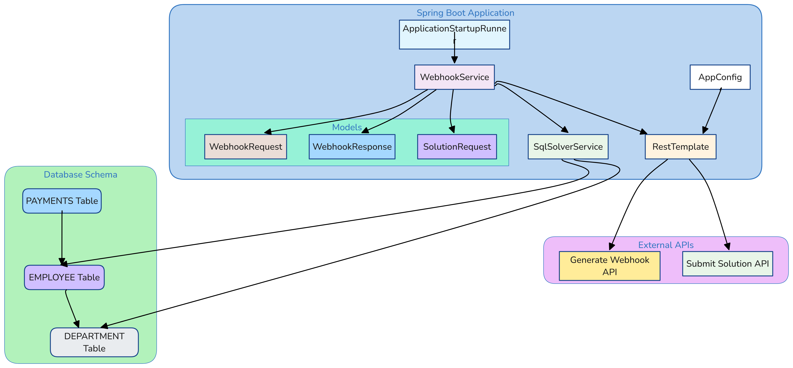
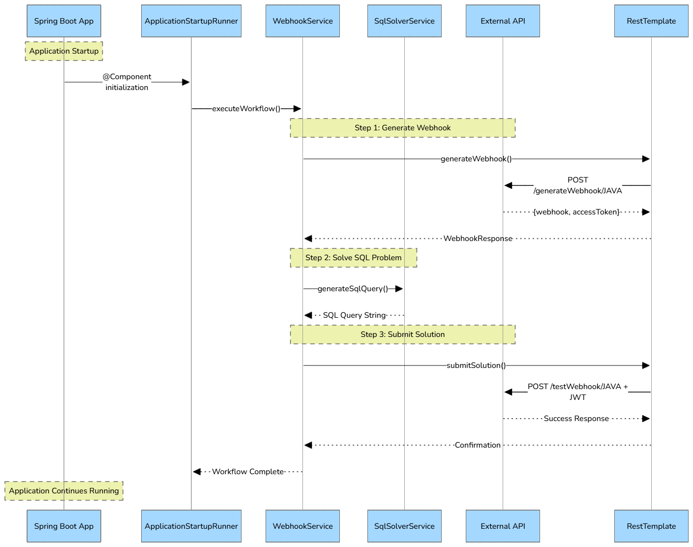

# Webhook SQL Solver - Spring Boot Application

## 📋 Overview
This Spring Boot application is designed to automatically solve a SQL challenge through a webhook-based workflow. The application demonstrates enterprise-level Java development practices, RESTful API integration, and 
automated SQL problem-solving capabilities.

## 🎯 Key Features
- **Automatic Startup Execution:** No manual intervention required
- **Webhook Integration:** Seamless API communication with external services 
- **JWT Authentication:** Secure token-based authentication
- **SQL Problem Solving:** Intelligent query generation for complex database scenarios
- **Enterprise Architecture:** Clean code structure following SOLID principles
- **Comprehensive Logging:** Detailed execution tracking and error handling

## 🚀 Problem Statement
The application solves the following SQL challenge:
```angular2html
Calculate the number of employees who are younger than each employee, grouped by their respective departments.
```
For each employee, return the count of employees in the same department whose age is less than theirs, ordered by 
employee ID in descending order.

## 🏗️ Architecture Overview



## 🔄 Application Flow



## 📁 Project Structure
```
webhook-sql-solver/
├── 📁 src/main/java/com/example/webhook/
│   ├── 📄 WebhookSqlSolverApplication.java    # Main Spring Boot class
│   ├── 📁 config/
│   │   └── 📄 AppConfig.java                   # Configuration beans
│   ├── 📁 model/
│   │   ├── 📄 WebhookRequest.java             # Request DTO
│   │   ├── 📄 WebhookResponse.java            # Response DTO
│   │   └── 📄 SolutionRequest.java            # Solution DTO
│   ├── 📁 service/
│   │   ├── 📄 WebhookService.java             # API communication
│   │   └── 📄 SqlSolverService.java           # SQL generation
│   └── 📁 runner/
│       └── 📄 ApplicationStartupRunner.java   # Startup trigger
├── 📁 src/main/resources/
│   └── 📄 application.properties               # App configuration
├── 📄 pom.xml                                  # Maven dependencies
├── 📄 README.md                                # This file
└── 📄 .gitignore                               # Git ignore rules
```

## 🚀 Getting Started
Prerequisites
Verify Java installation
```bash
#Verify Java installation
java -version
# Should show: openjdk version "17.x.x" or higher

# Verify Maven installation  
mvn -version
# Should show: Apache Maven 3.x.x
```

### Installation & Running

1. Clone the Repository
```bash
git clone https://github.com/yourusername/webhook-sql-solver.git
cd webhook-sql-solver
```
2. Build the Application
```bash
mvn clean package
```
3. Run the Application
```bash
# Option 1: Using Maven
mvn spring-boot:run

# Option 2: Using JAR file
java -jar target/webhook-sql-solver-1.0.0.jar
```

## 🧪 Testing
Manual Testing
The application automatically executes upon startup. Monitor the logs to verify:

✅ Webhook generation successful\
✅ SQL query generated correctly\
✅ Solution submitted successfully\
✅ No error messages in logs\

